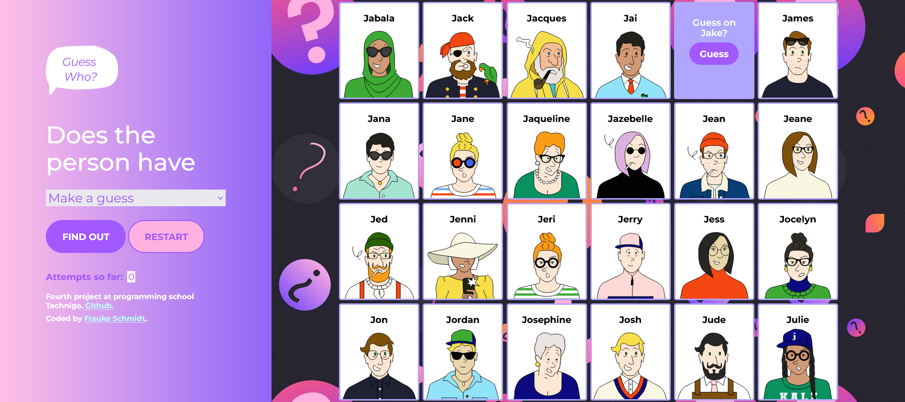

# Project Name
Technigo-project4-project-guess-who
Build an in interactive game "Guess Who".
# Technigo web development bootcamp august 2023 - jan 2024: project 2

This is a solution to the fourth project for the students:
*This week's exciting project is all about building a digital version of the* classic board game [Guess Who](https://en.wikipedia.org/wiki/Guess_Who%3F) *using JavaScript, HTML, and CSS.*

You'll get to apply concepts like DOM manipulation, event handling, function definitions, conditional statements, delayed execution, variable assignment, object and array manipulation.

**What you need to do**

✓ The board with characters should be generated when the website is loaded.

✓ A randomly selected person should be set as the secret when the game starts.

✓ You should be able to select questions to ask about the people and filter the board based on those questions.

✓ You should also give the player feedback with alerts

✓ You should be able to guess the secret person and get an answer if it's correct or not.

✓ Follow the guidelines on [how to write good code](https://www.notion.so/59abdd4307a24f5ca7914d566326f4df?pvs=21)

## Table of contents

  - [Overview](#overview)
  - [Screenshot](#screenshot)
  - [Links](#links)
  - [My process](#my-process)
  - [Built with](#built-with)
  - [What I learned](#what-i-learned)
  - [Continued development](#continued-development)
  - [Useful resources](#useful-resources)
  - [Author](#author)

## Overview

4th challenge for front end developer students.

### Screenshot

.

### Links

- Solution URL: [https://github.com/colognia/Technigo-project4-project-guess-who]
- Live Site URL: [https://colognia.github.io/Technigo-project4-project-guess-who/]

## My process

- coding one step after the other
- testing every part in browser and in case of problems with console.log and with a validator
- drawing the data flow on paper on day 3
- modifying html and css for styling page
- consulting my own notes regarding usage of comandos and other resources

### Built with

- vanilla JS
- Semantic HTML5 markup
- CSS custom properties
- editor: visual studio code

### What I learned 

How to manipulate the DOM with vanilla JS, catching and processing events, how ta access and process data in objects and arrays, how to conduct the flow of executions.

### Continued development

I need to understand the different kinds of event handlers better and the flow of variables from/to them. Furthermore understanding someone elses given code to work with.

### Useful resources

stackoverflow, W3schools, pythontutor.com, youtube videos.

## Author

- Linkedin - (https://www.linkedin.com/in/frauke-s-395242201/)

